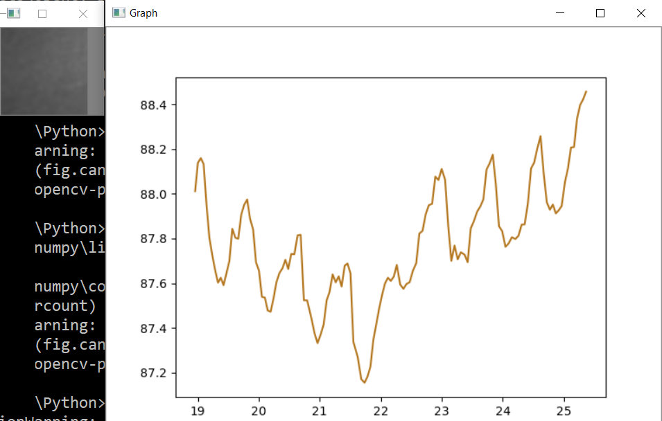

# Remote Heart Rate Detection

 The heart rate using a webcam.

Usage: run the app, place the body this way that face skin will be in the crop area, stay still and watch the graph.

# Working
The idea of determining the heart rate is that the skin tone changes slightly due to the flow in the blood vessels. So we need a picture crop, which contains only a fragment of the skin.
For the selected image fragment, we get the average brightness value and add it to the array along with the measurement timestamp.
The numpy.average function calculates the average of a two-dimensional array, at the output, we get a number, which is the average brightness of our 100x100 square frame.
OpenCV works with images in numpy format, so I have to convert an image using the numpy.fromstring function.

